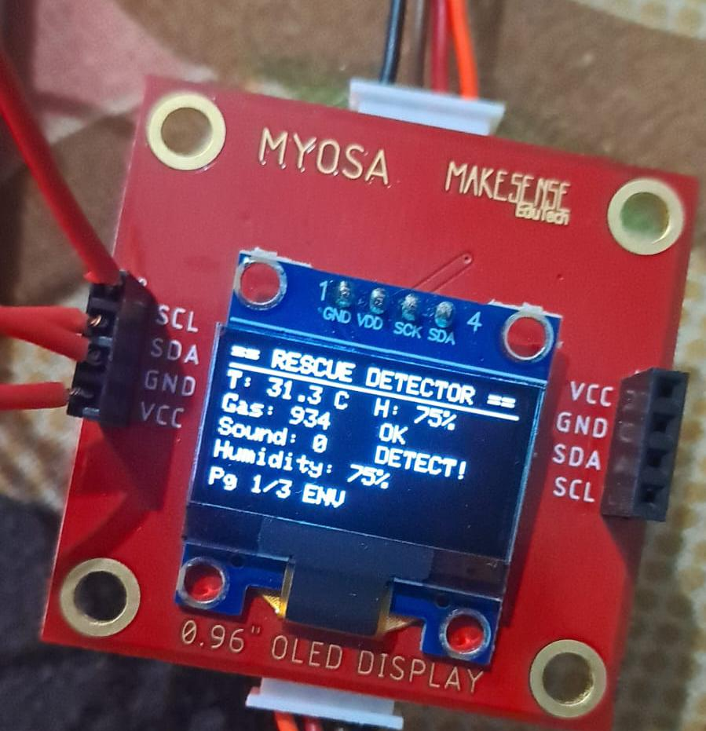
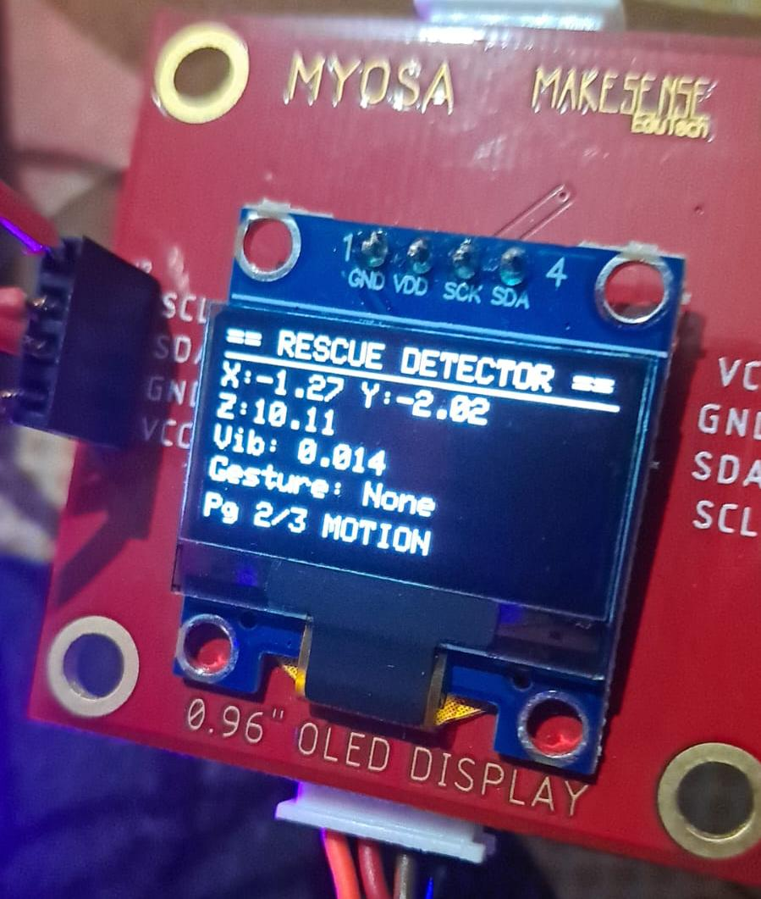
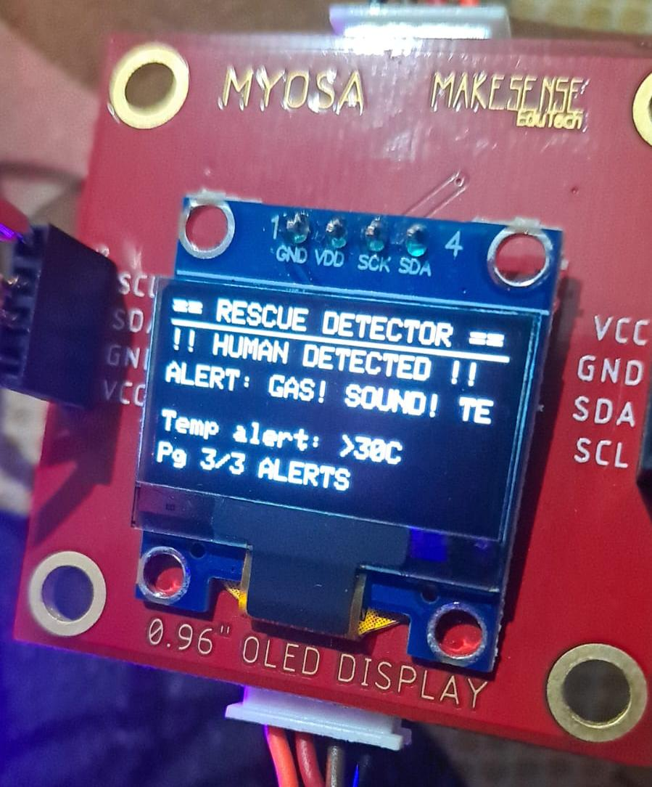
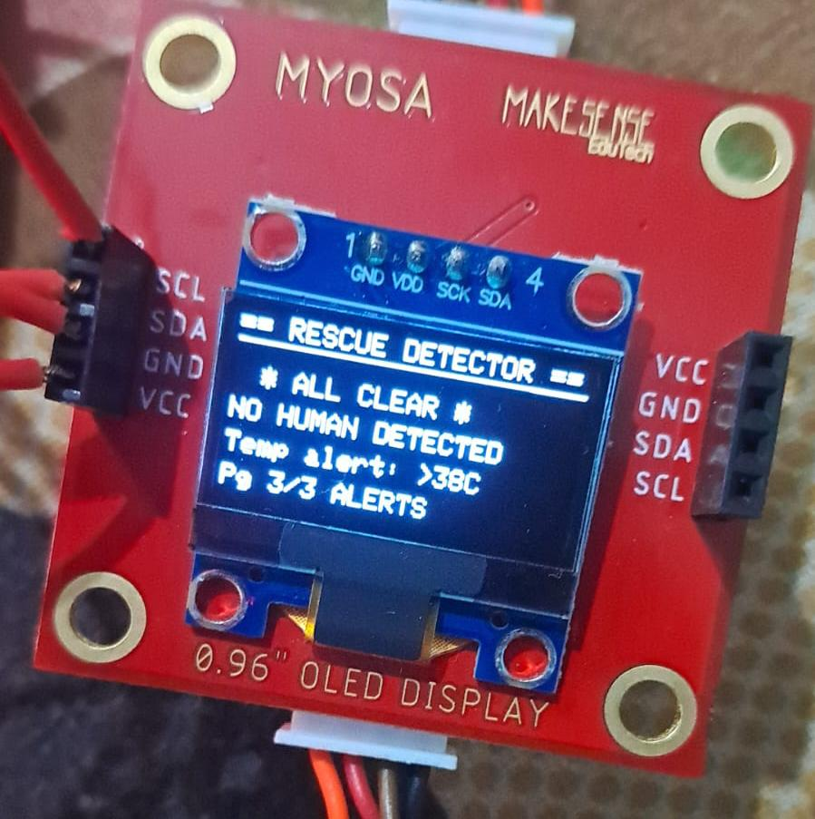
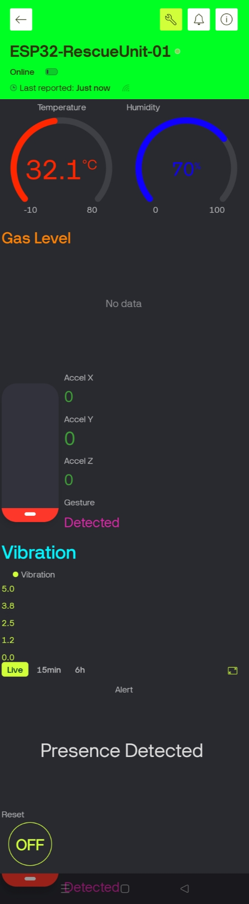
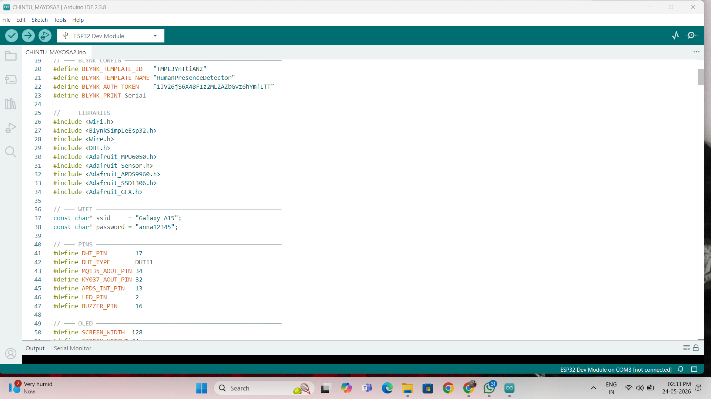
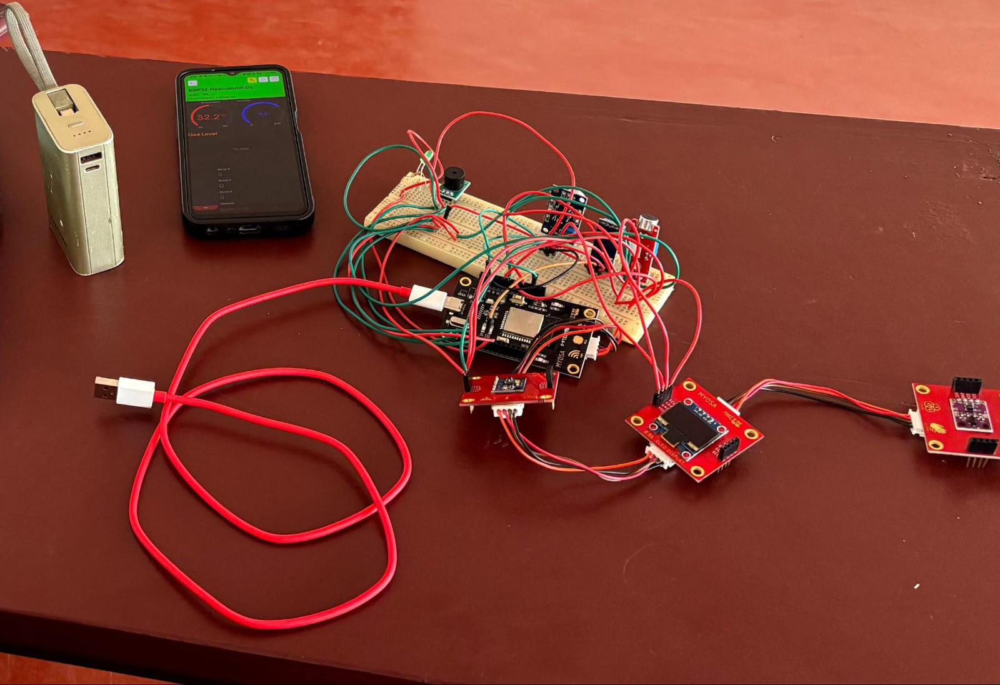

# myosa-swarmsense-lite
IoT-based multi-sensor disaster rescue system using ESP32 and MYOSA SwarmSense Lite for human presence detection.

## Project Images

## Project Videos

### Presentation Video

[Presentation Video](videos/presentation.mp4)

### Demonstration Video

[Demonstration Video](videos/demonstration.mp4)
